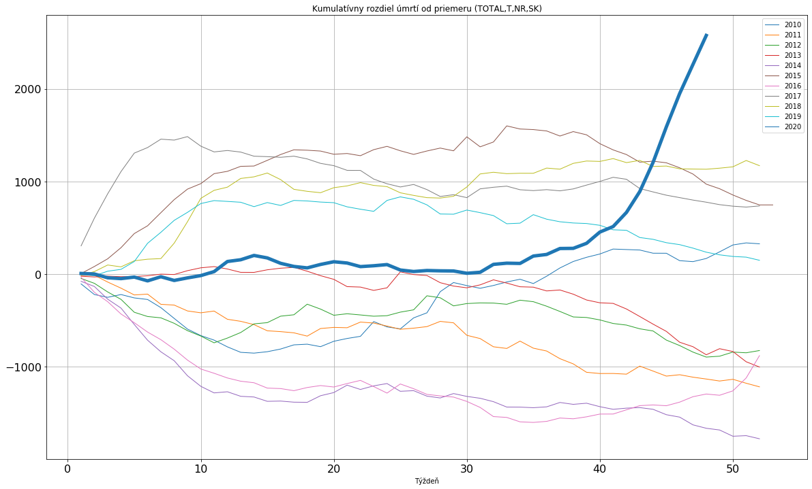

# Covid deaths in 2020
Analysis of excessive deaths from COVID for Slovakia (and potentially other countries from EU region)

Difference in number of deaths against the 10 year average for Slovakia

## Running in Google Collaboratory
If you want to try it out and maybe explore statistics for your country or drill down how COVID affected certain age groups, you can run it in your browser.

1. Open [colab](https://colab.research.google.com/)
2. Switch to Github tab and enter URL: `https://github.com/instea/covid-deaths`
3. Select from menu Runtime > Run all

